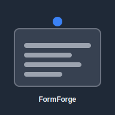

# 🚀 FormForge - Dynamic Form Builder

<div align="center">



**A modern, intuitive form builder application built with React, TypeScript, and Redux**

[](https://github.com/ullassa/Form-Forge)
[](https://github.com/ullassa/Form-Forge)
[](LICENSE)

[🌟 Live Demo](#) | [📖 Documentation](#features) | [🚀 Quick Start](#quick-start) | [🤝 Contributing](#contributing)

</div>

---

## 📋 Table of Contents

- [Overview](#overview)
- [✨ Features](#features)
- [🛠️ Tech Stack](#tech-stack)
- [🚀 Quick Start](#quick-start)
- [📁 Project Structure](#project-structure)
- [🎯 Core Features](#core-features)
- [🔧 Development](#development)
- [📱 Usage Guide](#usage-guide)
- [🎨 Theming](#theming)
- [📦 Build & Deployment](#build--deployment)
- [🤝 Contributing](#contributing)
- [📄 License](#license)

---

## 🌟 Overview

**FormForge** is a powerful, modern form builder application that empowers users to create dynamic, interactive forms with an intuitive drag-and-drop interface. Built with cutting-edge web technologies, it offers a seamless experience for form creation, configuration, and management.

### Why FormForge?

- 🎨 **Intuitive Design**: Beautiful, responsive UI built with shadcn/ui components
- ⚡ **Lightning Fast**: Powered by Vite for instant hot reload and optimized builds
- 🔒 **Type Safe**: Full TypeScript implementation for robust development
- 🎯 **Real-time Preview**: See your forms in action as you build them
- 💾 **Local Storage**: No backend required - forms saved locally
- 🌙 **Dark/Light Mode**: Comprehensive theming system
- 📱 **Responsive**: Works perfectly on desktop, tablet, and mobile

---

## ✨ Features

### 🎛️ **Form Builder**
- **Drag & Drop Interface**: Intuitive field placement and reordering
- **7 Field Types**: Text, Number, Textarea, Select, Radio, Checkbox, Date
- **Field Configuration**: Custom labels, placeholders, validation rules
- **Derived Fields**: Auto-calculated fields (e.g., age from birthdate)
- **Validation Rules**: Required, length limits, email format, custom patterns

### 📋 **Form Management**
- **Save & Load**: Persistent form storage with localStorage
- **Form Library**: Organize and manage multiple forms
- **Search & Filter**: Find forms quickly with built-in search
- **Export/Import**: Share forms as JSON files
- **Form Templates**: Pre-built form templates for common use cases

### 🔍 **Real-time Preview**
- **Live Preview**: See forms exactly as users will
- **Form Testing**: Submit and validate forms in preview mode
- **Responsive Preview**: Test forms on different screen sizes
- **Validation Testing**: Real-time validation feedback

### 🎨 **User Experience**
- **Dark/Light Themes**: Automatic system detection with manual override
- **Responsive Design**: Optimized for all device sizes
- **Accessibility**: WCAG compliant components
- **Smooth Animations**: Polished interactions with Framer Motion

---

## 🛠️ Tech Stack

### **Frontend Framework**
- **React 18** - Modern React with concurrent features
- **TypeScript 5.6** - Type-safe development
- **Vite 5.4** - Lightning-fast build tool and dev server

### **State Management**
- **Redux Toolkit 2.8** - Predictable state container
- **React Redux 9.2** - Official React bindings for Redux
- **TanStack Query 5.6** - Server state management (configured for future API integration)

### **UI & Styling**
- **shadcn/ui** - High-quality, accessible component library
- **Radix UI** - Unstyled, accessible UI primitives
- **Tailwind CSS 3.4** - Utility-first CSS framework
- **Lucide React** - Beautiful, customizable icons
- **Framer Motion 11** - Smooth animations and transitions

### **Form Handling**
- **React Hook Form 7.5** - Performant forms with easy validation
- **Hookform Resolvers 3.1** - Schema validation integration
- **Zod 3.24** - TypeScript-first schema validation

### **Development Tools**
- **ESBuild 0.25** - Fast JavaScript bundler
- **PostCSS 8.4** - CSS transformation tool
- **Cross-env** - Cross-platform environment scripts

### **Utilities**
- **date-fns 3.6** - Modern JavaScript date utility library
- **nanoid 5.1** - URL-safe unique string ID generator
- **clsx 2.1** - Conditional className utility
- **wouter 3.3** - Minimalist routing for React

---

## 🚀 Quick Start

### Prerequisites
- **Node.js** 18+ 
- **npm** 8+ or **yarn** 1.22+

### Installation

```bash
# Clone the repository
git clone https://github.com/ullassa/Form-Forge.git

# Navigate to project directory
cd Form-Forge

# Install dependencies
npm install

# Start development server
npm run dev

# Open your browser
# Navigate to http://localhost:3000
```

### Available Scripts

```bash
# Development
npm run dev          # Start development server with hot reload
npm run dev-simple   # Start minimal development server
npm run dev-minimal  # Start basic development server

# Production
npm run build        # Build for production
npm run start        # Start production server
npm run check        # Type checking
```

---

## 📁 Project Structure

```
FormForge/
├── 📁 client/                    # Frontend application
│   ├── 📁 public/               # Static assets
│   │   ├── icon.svg             # App icon
│   │   ├── icon-192.png         # PWA icon
│   │   └── manifest.json        # PWA manifest
│   └── 📁 src/                  # Source code
│       ├── 📁 components/       # React components
│       │   ├── 📁 FormBuilder/  # Form building interface
│       │   ├── 📁 FormPreview/  # Form preview components
│       │   ├── 📁 Layout/       # Layout components
│       │   ├── 📁 MyForms/      # Form management
│       │   └── 📁 ui/           # shadcn/ui components
│       ├── 📁 hooks/            # Custom React hooks
│       ├── 📁 lib/              # Utility libraries
│       ├── 📁 pages/            # Application pages
│       ├── 📁 store/            # Redux store & slices
│       ├── 📁 types/            # TypeScript type definitions
│       └── 📁 utils/            # Utility functions
├── 📁 server/                   # Backend server
│   ├── dev-server.ts            # Development server
│   ├── index.ts                 # Main server file
│   └── storage.ts               # Storage utilities
├── 📁 shared/                   # Shared types & schemas
│   └── schema.ts                # Zod schemas
├── 📄 package.json              # Dependencies & scripts
├── 📄 tailwind.config.ts        # Tailwind configuration
├── 📄 tsconfig.json             # TypeScript configuration
├── 📄 vite.config.ts            # Vite configuration
└── 📄 README.md                 # This file
```

---

## 🎯 Core Features

### 🏗️ **Form Builder Interface**

The heart of FormForge is its intuitive form builder:

1. **Field Palette**: Drag field types from the left panel
2. **Form Canvas**: Drop and arrange fields in the center
3. **Configuration Panel**: Customize selected fields on the right
4. **Real-time Updates**: See changes instantly

### 🔧 **Field Configuration**

Each field type supports comprehensive configuration:

```typescript
interface FormField {
  id: string;
  type: FieldType;
  label: string;
  placeholder?: string;
  required: boolean;
  options?: string[];           // For select, radio, checkbox
  validationRules: ValidationRule[];
  derivedConfig?: DerivedFieldConfig;
}
```

### 📋 **Supported Field Types**

| Field Type | Description | Configuration Options |
|------------|-------------|----------------------|
| **Text** | Single-line text input | Min/max length, patterns, placeholder |
| **Number** | Numeric input | Min/max value, step, decimal places |
| **Textarea** | Multi-line text input | Rows, character limits, placeholder |
| **Select** | Dropdown selection | Options, multiple selection |
| **Radio** | Single choice from options | Custom options, default selection |
| **Checkbox** | Multiple choice options | Custom options, pre-selected |
| **Date** | Date picker | Date format, min/max dates |

### 🧮 **Derived Fields**

Create smart fields that calculate values automatically:

```typescript
// Example: Calculate age from birthdate
{
  type: 'derived',
  parentField: 'birthdate',
  calculation: 'age',
  label: 'Age'
}
```

---

## 📱 Usage Guide

### Creating Your First Form

1. **Navigate to Form Builder**
   ```
   Click "Create Form" or visit /create
   ```

2. **Add Fields**
   ```
   Drag field types from the left panel to the form canvas
   ```

3. **Configure Fields**
   ```
   Click on any field to open the configuration panel
   Customize labels, validation, and options
   ```

4. **Preview Your Form**
   ```
   Click "Preview" to test your form in real-time
   ```

5. **Save Your Form**
   ```
   Click "Save Form", enter a name, and store it locally
   ```

### Managing Forms

- **View All Forms**: Navigate to "My Forms" page
- **Search Forms**: Use the search bar to find specific forms
- **Edit Forms**: Click "Edit" on any saved form
- **Delete Forms**: Remove forms you no longer need
- **Export Forms**: Download forms as JSON files

### Form Validation

FormForge supports comprehensive validation:

```typescript
// Validation rule examples
{
  type: 'required',
  message: 'This field is required'
},
{
  type: 'minLength',
  value: 3,
  message: 'Must be at least 3 characters'
},
{
  type: 'email',
  message: 'Please enter a valid email'
}
```

---

## 🎨 Theming

FormForge includes a comprehensive theming system:

### Theme Toggle
- **Auto-detect**: Respects system preference
- **Manual Override**: Switch between light and dark modes
- **Persistent**: Theme preference saved locally

### Custom Themes
Easily customize the appearance by modifying CSS variables:

```css
:root {
  --primary: 222.2 84% 4.9%;
  --primary-foreground: 210 40% 98%;
  --secondary: 210 40% 96%;
  --secondary-foreground: 222.2 84% 4.9%;
  /* ... more variables */
}
```

---

## 📦 Build & Deployment

### Production Build

```bash
# Build the application
npm run build

# Files will be generated in:
# - dist/public/     (client build)
# - dist/           (server build)
```

### Deployment Options

1. **Static Hosting** (Netlify, Vercel, GitHub Pages)
   ```bash
   # Deploy the dist/public/ directory
   ```

2. **Node.js Server**
   ```bash
   # Run the full-stack application
   npm run start
   ```

3. **Docker** (Coming Soon)
   ```bash
   # Build and run with Docker
   docker build -t formforge .
   docker run -p 3000:3000 formforge
   ```

---

## 🤝 Contributing

We welcome contributions! Here's how to get started:

### Development Setup

```bash
# Fork the repository
git clone https://github.com/your-username/Form-Forge.git

# Create a feature branch
git checkout -b feature/amazing-feature

# Make your changes and commit
git commit -m "Add amazing feature"

# Push to your fork
git push origin feature/amazing-feature

# Create a Pull Request
```

### Code Style

- **TypeScript**: Strict type checking enabled
- **ESLint**: Follow the existing linting rules
- **Prettier**: Auto-formatting configured
- **Conventional Commits**: Use semantic commit messages

### Areas for Contribution

- 🐛 **Bug Fixes**: Report and fix issues
- ✨ **Features**: Add new field types or functionality
- 📚 **Documentation**: Improve docs and examples
- 🎨 **UI/UX**: Enhance the user interface
- ⚡ **Performance**: Optimize loading and rendering

---

## 📄 License

This project is licensed under the **MIT License** - see the [LICENSE](LICENSE) file for details.

---

## 🙏 Acknowledgments

- **shadcn/ui** - For the beautiful component library
- **Radix UI** - For accessible UI primitives
- **Tailwind CSS** - For the utility-first CSS framework
- **React Team** - For the amazing React framework
- **Vite Team** - For the lightning-fast build tool

---

## 📞 Support

- 🐛 **Bug Reports**: [GitHub Issues](https://github.com/ullassa/Form-Forge/issues)
- 💡 **Feature Requests**: [GitHub Discussions](https://github.com/ullassa/Form-Forge/discussions)
- 📧 **Email**: [Contact Us](mailto:your-email@example.com)

---

<div align="center">

**Made with ❤️ by [ullassa](https://github.com/ullassa)**

⭐ **Star this repo if you find it helpful!** ⭐

</div>